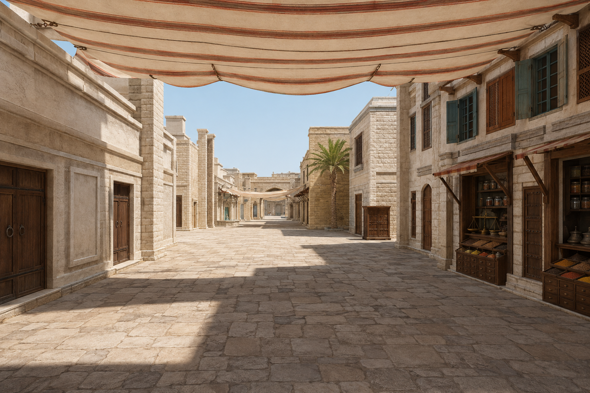

# Bazaar design atlas

**Revision 2 / proposed / 2026-09-04. Implementation is deferred until design approval.**

Start with the 57-page A3 [design atlas PDF](design-atlas.pdf) (use its building-ID bookmarks), then inspect the linked [building schedules](buildings.md), [assembly designs](assets.md) and [reference register](references.md). The atlas is the visual review edition; its drawings are derived from the schedules and inspected map data. It does not replace the source spec.

## What changed

The first draft covered the map but was too text-heavy and relied on uniform asset variants. This revision makes the work drawing-led: dimensioned plans/elevations, side/rear/roof decisions, fit sections, eight new GPT-generated references and assigned construction variants. It preserves the finite inventory and exact placement decisions unless a specific revision is stated.

Buildings are the production units. Reuse masonry families, timber sections, hinges and source textures; give trades and households different complete compositions. The eight shutter windows now use three constructions, nine screens use three, three spice counters express different trades, and four rug displays use two forms. A new dye-sample counter has two exact uses. The original textile booth stays untouched; only one additional booth is proposed, at Textile east GROUND_01. The former Souk-north duplicate is replaced in the design by a dye-sample seller.

The revised process follows the useful sequence in OpenAI's [Architectural visualization with Astra](https://developers.openai.com/blog/architectural-visualization-with-astra): establish visual direction, approve spatial design, build editable Blender geometry, inspect solid and rendered views, then validate the engine transfer. The article used Blender Python scripts and application inspection. Blender MCP is an optional control interface, not an asset format or a quality guarantee.

## Inventory and authority

**69 / 69 entries retain explicit treatments:** 35 registered building/wall records, 25 public-space/route records, nine additional ownership groups. All 38 frontage spans, 74 frontage exemptions, residual surfaces, roof groups, overheads and out-of-bounds context are included. Linked owner records are one physical composition where the plan supports that grouping. No new inventory loop.

| File | Owns |
|---|---|
| [buildings.md](buildings.md) | Proposed owner relationships, exact face counts/axes/datums, retain/replace/blank decisions |
| [assets.md](assets.md) | Complete assembly designs, construction variants, exact placement membership, suppression and fit contracts |
| [references.md](references.md) | Eight current visual references, adoption limits, old-target routing, generation prompts/provenance |
| [design-atlas.pdf](design-atlas.pdf), `drawings/*.svg` | Derived review drawings and presentation; no separate implemented transforms |
| [overview.svg](overview.svg), [assembly-fit.svg](assembly-fit.svg) | Ownership/route overview and booth/central-block fit diagram |
| [Live map spec](../specs/map_spec.json) | Implemented geometry/placements, anchors, collision/traversal constraints and registry |
| [AGENTS.md](../../../AGENTS.md#map-development), [quality bar](../quality-bar.md), [map-polish](../../../.claude/skills/map-polish/SKILL.md) | Safeguards, visual judgment and bounded implementation checks |

The inspected source snapshot remains `dev-4` / `6a34462`; spec SHA-256 `eb1dcf02c1b550272f7b08588150049eb5ed41cf767382fc342ff7d259384d4f`. Buildings may be designed in Blender after approval; the source spec continues to own world placement, gameplay layout and constraints. Export individual building/assembly visual units with fixed local origins and stable IDs. Avoid a second scene-placement database or a monolithic replacement map mesh.

Generated concept images are artistic proposals, not measurements, game screenshots or proof of implementation. Their incidental changes to dimensions, supports, cover, steps or opening counts are excluded unless the dimensioned card specifies them. The real CS2 daylight screenshots remain finish benchmarks; new references supersede the old generic main-hall image and numbered concept targets.

## Review and approval

Use `proposed → approved → implemented → verified`. Record approval at a useful scope: district direction, a complete building, or a named assembly/placement batch. No approval is inferred from this package or from generating an image.

Only the existing textile booth has user-reported visual approval at `ARCH_FRONTAGE_COVERED_SOUK_EAST_GROUND_02`. This does not approve a new placement, its neighboring building, or its performance/clearance. No Blender model or runtime map change was made during this revision.

Review the atlas in this order: masterplan and six district boards; complete-building drawings and blank faces; construction/placement sheets; measurement exceptions and first production batch. Approve the design direction and selected building task before implementation. After approval, judge the first complete building in the real game before repeating its assemblies.

## First production batch

1. **BLD_DYERS_HOUSE:** complete single-storey building, centered closed door and paired SC-D screens, quiet sides/rear, finished roof/base and flush entrance. This proves the full Blender-building workflow. M02/M05; preserve adjacent workshop and every route/collider.
2. **BLD_DYERS_ARCADE_E:** finish one three-bay arcade around the existing approved booth. South packing cabinet, center original booth, north DY-S dye counter. Proves differing businesses in a shared shell, supports and bounded suppression. M02/M03.
3. **BLD_SPICE_ROW_W:** finish the mixed-use building with SH-L/SH-P/SH-W upper closures and SP-D/SP-G/SP-A trade counters. Proves material continuity without identical storefronts. M02/M03/M05.
4. **Compatible reuse:** after pilot approval, use the finite assignments in assets.md. The one new textile booth belongs at `FRONTAGE_TEXTILE_ARCADE_EAST` / `GROUND_01`; each placement needs fit and route verification.

## Blender development procedure after approval

1. Select an approved, dependency-ready building or complete-asset task.
2. Read its drawing, building card, asset definitions and placement assignments.
3. Inspect the pilot and preserve existing work. Bring the current footprint, neighboring architecture, floor/route envelopes and matching camera poses into Blender as locked reference collections.
4. Build one complete composition in metres with editable named objects and reproducible export. Use shared components where useful, but the selected construction variants and owner-specific composition are deliberate.
5. Review plan, all visible elevations and a solid/clay view before material polish. Resolve the entire building's corners, rear, roof, supports and floor contact.
6. Add materials at real scale and the assigned goods. Review matching daylight perspective/close views; no invisible interiors or ornamental detail unrelated to a player-visible outcome.
7. Export GLB visuals and integrate the pilot, suppressing exactly the replaced assembly. Keep implemented world transforms in the source spec and preserve collision, spawns, routes, cover, grounding and sightlines.
8. Review matching game images early; finish relevant collision, body clearance, traversal and performance checks. Cycles quality does not establish browser performance or material parity.
9. Obtain visual approval of the complete pilot before propagation. Reuse at approved compatible locations and verify every fit.
10. Update scoped status and relevant map authority. Stop at the approved task boundary; no unrequested commit, new framework, editor or endless polish pass.

The existing booth's `.blend` and `build.py` remain the source/export example. Use `/Applications/Blender.app/Contents/MacOS/Blender` and the existing runtime import path. Blender MCP may assist inspection or execution later; it does not remove the need for saved editable source and repeatable export. No new modeling tool installation is part of this design revision.

## Measurements before dependent implementation

| ID | Measure before implementation | Affected scope / decision |
|---|---|---|
| M01 | Inspect the coincident massing shells at Fountain east and Souk west: x=36..40.8 and x=36.2..41, matching y spans 33.28..39 and 44..46.72. Identify which shell owns each visible corner/roof strip. | Proposed one central merchant block with court front and Souk trade back. Keep both existing IDs and geometry; select one visible finish at overlaps. No hidden passage or new parcel boundary. |
| M02 | At each pilot: usable reveal width/depth at floor, counter, shelf, arch spring and ledger; actual wall plane, threshold top, current collision/body sweep and attached fixture AABBs. Compare the fixed complete asset bounds. | Mounting fit only. No model distortion, moving collision, or rebuilding arches to force a fit. The booth low envelope must be checked separately from its wide high awning. |
| M03 | At each existing shade endpoint: supporting masonry/beam height, distance to real support, cloth minimum height/sag, overlap with signs and upper openings. At both new booth candidates also measure awning clearance from shared canopy. | Existing overhead heights sometimes exceed low frontage wall tops; a supported roof attachment must exist within the unchanged skyline. If it cannot, defer that attachment/placement and surface the conflict. |
| M04 | At the Dogleg west blind cart-gate: actual frame outer width and top, current sealed backing, adjacent vat/workstation envelope. | Retain the existing tall blind gate; do not reinterpret the old 2.965 m brief as permission to shrink or open it. |
| M05 | At boundary kits and connector turns: rendered projections through the whole player body and the real supported wall intervals/returns. | Do not import the old camera-only low-clutter exemption. Recess offending visual dressing within its owner during that implementation task; retain all gameplay geometry. |

No gameplay-changing proposal is included. If a model needs a wider route, moved collider, new floor, changed sightline or raised skyline to fit, surface that conflict separately. Final mounting tolerances and material tuning belong to the approved pilot, not invented measurements in this book.

## Clear handoffs

| Request | Read / work | Approval or measurement |
|---|---|---|
| Develop the next reusable asset | B21 drawing and BLD_DYERS_HOUSE card; ASMB_SCREEN_WINDOW / SC-D. Finish the complete framed screen within the house pilot. | Design approval, M02, pilot review before other uses |
| Finish BLD_DYERS_HOUSE | B21 plan/elevations/section, R07 reference, common face rules and P14 route. Door, two screens, both sides, rear, roof and floor contact are one task. | Building approval, M02/M05, Blender solid review then game/traversal/performance checks |
| Place the textile booth elsewhere | ASSET_TEXTILE_BOOTH / P-BOOTH, BLD_RUG_ARCADE_E and P04. One new location: Textile east GROUND_01. | Placement approval, M02/M03, bounded old-kiosk/grille/awning suppression and per-fit verification |

## Obsolete guidance and conflict handling

`CLAUDE.md` remains startup navigation. This package is the current development entry point through AGENTS. Old roadmaps, `archive/map-polish-queue-sections-2026-08-05.md`, archived critic/cadence rules, and short-term rollups are historical evidence, not a queue or approval. DEC-023/024 remain superseded by DEC-025. Do not resurrect survey quotas, engine pins, automatic critics or an endless map-wide pass.

Existing `buildings[].brief`, `walls[]`, `needs` and generated bays sometimes disagree. The proposed cards explicitly resolve those design conflicts; preserve stable `servedBayId` and placement `anchorIds` when implementing an approved resolution. Source spec owns implemented truth, so an approved card is translated into the owning source records, never a duplicate live transform table.

The quality bar's type recipes are judgment aids, not reasons to add an unwanted balcony, door or prop. Compiler minimum-bay/material restrictions do not justify improvising against an approved card. Camera-only low-clutter or overhead allowances in old comments never override the full body-envelope safeguards. Surface real conflicts; do not weaken validation or rewrite unrelated instructions.

## Revision verification

The eight selected images were inspected; one entrance correction was made through image generation. All 57 atlas pages were rendered for visual review. Coverage remains 69/69 entries, 38/38 frontage spans and 36/36 registered assets. The 34 SVG building sheets cover all 35 registered records because B04/B17 share one physical-block sheet. Local links, SVG structure, assigned construction quantities and source references were checked. Runtime/spec/booth files and unrelated worktree changes remain unchanged; no implementation QA suite was run.
