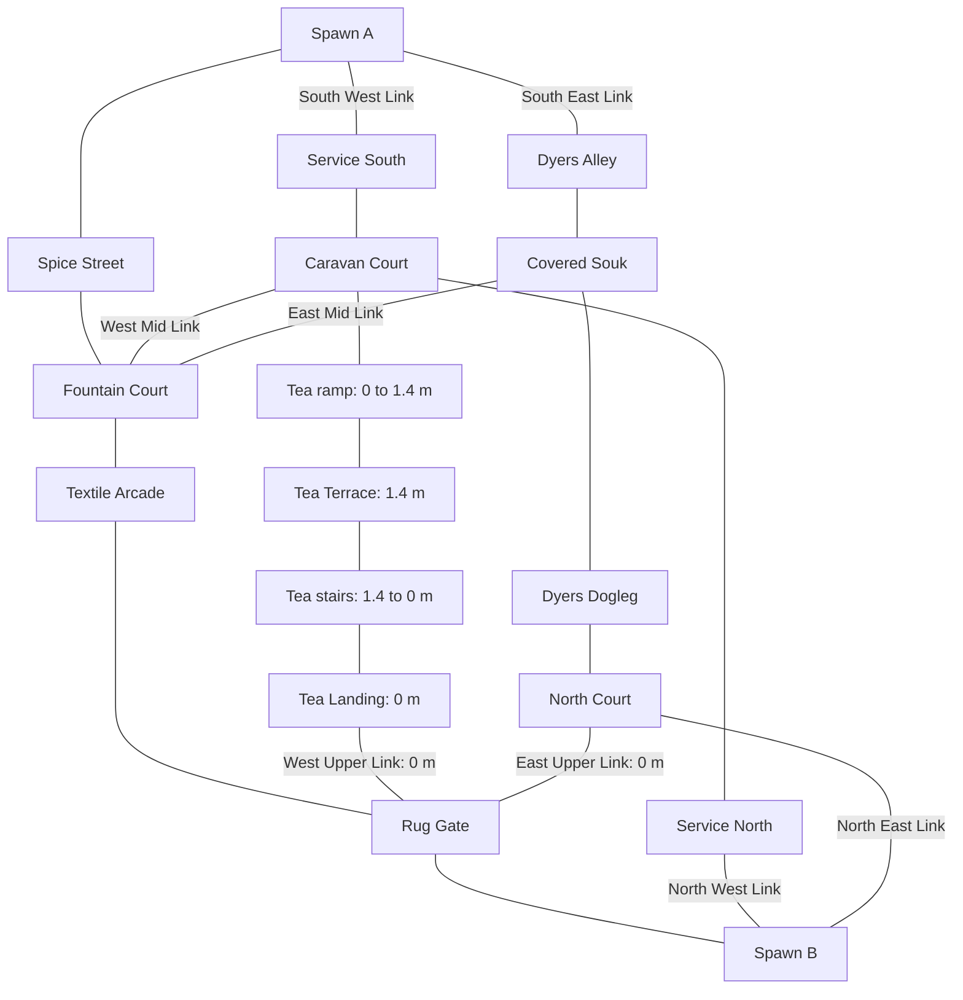

# Bazaar design review before Blender production

**Review date:** 2026-09-04. **Status:** recommendations, not design approval or implemented changes.

## Readiness verdict

**Hold full-building Blender production. The package is a useful assembly and frontage schedule, but it is not yet a resolved design for the whole Bazaar.** It improves trade identity, replacement boundaries, asset provenance, and placement discipline. It does not establish that the proposed buildings, roofscape, circulation, and combat spaces form the warm, layered city in the founding reference.

The largest problem is not missing decorative assets. The plan largely accepts the current spatial arrangement, freezes its heights and skyline, and then makes its facades more orderly. That can produce better-made versions of the same broad corridors, sealed display fronts, and tall service screens. A map-wide review of architectural massing and route composition is justified. A wholesale replacement of the gameplay graph is not yet justified by the available evidence; specific layout and elevation alternatives should be tested first.

The single 1.4 m terrace is real playable elevation, but **it does not provide enough varied vertical relationships to carry the map's verticality by itself**. It is principally an enclosed raised route with approaches at its ends. More decorative roof height will not change that. Conversely, adding a second platform without a useful encounter, escape choice, and bot counterplay would add elevation without improving the game.

The Dyers House can eventually prove a small building export workflow. Its unresolved concept proportions and omitted roof composition currently make it a poor first approval target. Even a successful house would not validate the Bazaar's street depth, commercial occupation, or elevated combat. Resolve those questions before multiplying finished assets.

### Review boundary and evidence status

- The user confirmed **current player-versus-bot survival**, **warm daylight with readable shade**, and **map-wide redesign recommendations when justified**. This review does not assume bombsites, team balance, round rotations, or multiplayer spawn rules.
- Initial Git inspection found **`dev-4` / `f0dab24`**, with an empty `git status --short`. The supplied `6a34462` was an older snapshot. No branch changes, commits, stash, reset, generation, captures, modeling, or runtime/spec edits were performed by this review.
- The live source spec SHA-256 is `eb1dcf02c1b550272f7b08588150049eb5ed41cf767382fc342ff7d259384d4f`. It matches both the atlas's recorded spec hash and the existing generated map's `generatedFrom.sha256`. The newer HEAD alone does not invalidate the atlas's source dimensions.
- A separate concurrent cleanup task changed documentation and removed an unrelated repair script. Its work is preserved. Its corrections to the reference hierarchy were independently checked in the diff. This review's only repository write is this document.
- Six bounded read-only research investigations covered reference fidelity, FPS circulation, playable elevation, heights/skyline, architectural realism, and Blender readiness. The lead inspected the founding image, all eight new concepts, all 57 atlas pages, the building drawings represented there, schedules and assignments, relevant source, and existing game images independently. Agent conclusions were treated as leads, not proof.
- **Observed** means directly visible in inspected images or present in source. **Judgment** means a design evaluation. **Hypothesis** means gameplay behavior requiring a moving, instrumented playtest. No fresh gameplay, traversal, collision, or performance pass is claimed.

## 1. The founding reference and artistic drift

The [founding main-hall image][founding] is an occupied street with a clear path through it. Close awnings and goods frame a middle distance of offset buildings; upper rooms, parapets, cloth and cables overlap against the sky; a substantial arch closes the distant view. The image contains stone and plaster, teal timber closures, warm masonry, varied frontage heights, hanging signs and textiles, and identifiable trade stock. Its atmosphere comes from the relationship between those layers, not an orange color filter or a high prop count.

It is not a construction drawing. Its lettering, some cable endpoints, ambiguous building junctions, stock piles, and rough paving must be interpreted rather than copied. The useful principle is a legible occupied edge around a genuinely clear walking envelope. Do not reproduce loose crates at turns, uncertain supports, or stock that the player can walk through.

| Reference element | Preserved in the package | Weakened or missing | Recommended interpretation |
|---|---|---|---|
| Layered street depth | Gates, courts, canopies and successive districts provide ingredients. | R01/R03 emphasize long open central corridors; R06 is an elevation study. No moving sequence demonstrates layered reveals. | Compose foreground attachments, a middle-distance turn or edge, and a distinct distant building from actual player positions. |
| Varied heights and stepped rooflines | Low/mid/hero profiles, Spawn-A parcels and background belts vary in height. | Repeated high-west/low-east relationships and small generated roof heads substitute for inhabited building mass. | Author coherent parcel and roof groups; keep deliberate low releases and a few taller occupied volumes. |
| Stone and plaster | Material families and R07/R08 retain both. | Large pale planes and systematic trim can flatten the district differences. | Give masonry, lime plaster and repair patches construction reasons and consistent scale. |
| Timber shutters/screens | Eight shutter replacements and nine screen placements are assigned. | Most closures share two standard envelopes; universal blank side/rear rules remove potential domestic evidence. | Keep the finite constructions; vary their relationship to rooms, stories and exposed party walls. |
| Supported awnings | Individual bracing, ledger and cloth requirements are strong. | Several fixed high street attachments lack a demonstrated support at that exact position. | Resolve each load path in a measured section before preserving the endpoint. |
| Hanging textiles | Six canopy spans and eight drying/laundry lines are retained. | All widths and gaps are frozen; R01 and R05 can read as a broad ceiling. | Preserve cloth as shade, trade and occupation, with sky gaps and readable threats underneath. |
| Trade-specific goods | Spice, grain, apothecary, rugs, light fabric and dry dye samples are differentiated. | Much activity becomes shallow furniture placed in sealed arch slots; customer/seller access is rarely shown. | Draw working space and storage relationships, even when interiors remain unmodeled and closed. |
| Signs | Standalone signs and integral landmark inscriptions have owners. | Reductions are mostly based on avoiding duplicates, not a district navigation study. | Distinguish business signs from route landmarks. Test recognition while approaching from both directions. |
| Warm light and readable shade | Existing game views already contain warm surfaces, sun and strong shade. | The new prompt set repeatedly asks for neutral daylight and excludes orange grading; the founding image's warmth is not otherwise translated into lighting decisions. | Use warm daylight, natural timber/textile color, and sufficient bounced light. Judge bots in shade before approving the look. |
| Believable occupation | Spawn-A back parcels, workshop rails, tea service and the approved booth are useful precedents. | Quiet walls, closed openings and empty returns are applied across too much of the map. | Keep quiet areas, but distinguish a maintained home, loading yard, wet workshop, retaining wall and civic building by actual use. |

### Incorrect retirement of the founding image

At the initial `f0dab24` snapshot, three documents explicitly subordinated it:

- `docs/map-design/quality-bar.md:14`: the new documents “replace the old main-hall image” as active targets.
- `development-plan/README.md:33`: the new references “supersede the old generic main-hall image.”
- `development-plan/references.md:3`: the eight generated images replace the old main-hall set and the old images are history rather than concurrent targets.

Those statements were wrong under the user's artistic authority. **The separate cleanup task has corrected these three passages in the current worktree.** The unresolved issue is the design itself: the atlas still opens on R01, the founding image is absent from its visual boards, and the generation prompts still encode the earlier neutral, restrictive direction. Correcting the hierarchy in prose does not retrospectively reconcile those proposals.

R01 is useful for joinery and distinct shops; R02 for civic stone; R03 for rug versus light-cloth trade; R04 for portal craft; R05 for tea materials; R06 for three different businesses; R07 for domestic construction; R08 for component craft. None independently replaces the founding image's urban composition. R06 also redraws the center booth; only the actual approved booth asset and its game evidence establish that booth's design.

## 2. Prioritized findings and revisions

Priority **P0** blocks broad design approval. **P1** blocks the affected building or district. **P2** belongs in the later scoped implementation. Revision classes distinguish **art/assembly**, **massing/light**, **layout/elevation/gameplay**, and **documentation**. No recommendation in this section has been implemented.

### P0-A. The drawings do not yet specify the complete visible buildings

**Observed.** The 34 SVG sheets represent all 35 registered records because B04/B17 share a sheet. Most plans are a filled rectangle and dashed roof setback; side/rear elevations are plain rectangles marked as quiet walls. Their notes explicitly say they are visual elevations rather than new floor plans or structural engineering, and defer existing roof geometry and skyline fixtures to source. The source nevertheless emits roof slabs, parapets, bulkheads, silhouette heads, upper projections and return treatments. See atlas pp. 15–48; [common face rules][buildings], lines 26–36; [roof and return code][architecture], lines 2886–3158.

**Judgment.** The sheets resolve opening counts and several useful datums. They do not resolve complete player-visible composition simply by assigning blank faces. An implementation agent must still choose which roof forms to reproduce, how attached wings meet, which side details disappear, and how supports meet real masonry. Those choices can materially change the approved-looking image.

**Revision: documentation and art/assembly.** Before a building is approved, provide its actual roof profile, exposed corners and party-wall junctions, one contextual plan, and the critical opening/awning section. Label retained runtime geometry separately from proposed Blender geometry. A full hidden interior is unnecessary; a diagram showing where a household or merchant could enter and occupy the building is enough. Do this for selected production buildings, not every invisible wall face.

**Specific contradiction: B21/R07.** B21 specifies an 8.25 × 4.2 × 4.5 m shell, a 1.05 × 2.25 m door, and 1 × 1.4 m windows at sill 0.85 m. The door head is exactly halfway up the scheduled wall. R07 visually places the door much closer to the roof. Its corrective prompt explicitly extended the door downward while retaining its head. The generated proportions therefore cannot validate the dimensioned design. Atlas p. 34 also leaves the large upper blank field and source rooftop fixtures unresolved. Choose whether to retain the 4.5 m wall and articulate that field, or approve a lower domestic roof. Do not silently enlarge the door or shrink the model to resemble R07.

### P0-B. The terrace is a raised corridor, not a map-wide high-ground system

**Observed.** All 25 traversal surfaces are at zero elevation except the Tea ramp, platform and descending stair surface. Their combined plan area is 192 m² out of 3,148 m² of authored zone rectangles, about 6.1%; only 80 m² is a flat elevated platform. This area ratio describes extent, not quality. The ramp rises 1.4 m over 8 m, a 17.5% grade, about 9.9°. The stairs descend 1.4 m over 6 m, about 13.1°, with ten visual steps: nominal 0.14 m rise and 0.60 m going. Their collision/grounding surface is a continuous ramp. Both upper links and the landing are at zero. See [spec][spec], lines 349–653, and [P10–P13][buildings].

The terrace midpoint stands between a 7 m Service-North spine at x=10..10.96 and the tea building at x=19..23.8, whose roof datum is 8.4 m above map zero. A standing player's eye on the terrace is 3.1 m above zero. These masses prevent a normal broad lateral overlook; the available elevation relationship primarily concerns the ramp/stair approaches and end views. Existing [Tea imagery][tea-shot] supports the enclosed-corridor reading. It does not prove that every oblique line is blocked.

**Judgment.** The rise is large enough to affect cover and aiming, and the ground bypass is valuable. Its architectural enclosure and return to zero before Rug Gate limit its wider tactical role. Ten shallow steps across an 8 m surface also read more as a broad stepped ramp than a compact old-city stair. Additional decorative balconies cannot compensate.

**Revision: layout/elevation/gameplay.** First test one deliberate opening in the terrace's western screen, around the central platform rather than a ramp transition. Study a short, clearly bounded overlook toward Service North, with a substantial parapet, readable approach from both ends, and exposure to a ground-level counter-angle. A trial parapet around 1.0–1.1 m above terrace level is a starting hypothesis, not an approved height. The existing 7 m screen, collision and sightlines would change; this is explicitly gameplay work.

If that produces a useful but still isolated decision, test a different elevation event near the Dyers Dogleg/North Court transition: a work terrace roughly 0.9–1.4 m high, two bot-usable approaches and a ground bypass. It should pressure one local encounter, not watch the entire east lane. Do not automatically clone Tea's dimensions or add both proposals before testing either.

**Runtime limit.** [TraversalSurfaceResolver.ts][surface-resolver], lines 98–101, explicitly describes a height field without stacked-floor support. A higher route beside a lower one is not inherently unsupported. A balcony/bridge with another playable route directly underneath it is a different runtime project. One-way drops likewise need an explicit player/bot traversal contract. They cannot be created through Blender visual geometry alone.

### P0-C. Broad connected routes have not been shown to create good survival encounters

**Observed.** The graph offers three continuous north/south routes, mid links at Fountain, upper links at Rug/North Court, and the optional Tea branch. It contains no authored degree-one zone. This is a useful foundation for escape and bot convergence. However, the six main rectangles share an aligned x=24..33 strip across their full north/south sequence. Player spawn centers are 78 m apart. This is plan alignment, **not a measured 78 m clear runtime sightline**: gates, props, walls and actual camera height must still be included.

Main district footprints are 12 m wide at Spice, 16 m at Fountain, 11 m at Textile and 13 m at Rug. Clear-width floors are 6 m main, 4.5 m side, 4 m elevation, and normally 3.5 m links. Service North is 32 m long and 7 m wide. Dyers Alley and Dogleg retain a continuous x=46..53 band through the wider Souk; the word “dogleg” does not itself establish a hard visual break. See [spec][spec], `zones`, `constraints`, `explicit_connectivity`.

The player runs at 6 m/s; the AK defaults to 200 m range and 600 RPM. Baseline enemy vision reaches 80–95 m, with burst-distance bands at 8 and 18 m. Ten enemies spawn per wave; baseline simultaneous attackers rise from one to four by tier, and pressure begins earlier in later waves. Thus long firing lanes and reload escapes matter more here than hypothetical team rotations. See [player controller][player], lines 13–22; [AK controller][weapon], lines 10–12; [gameplay tuning][tuning], lines 390–473.

**Hypotheses.** The main route may permit repetitive retreat-and-fire play. Service North may be a long low-choice recovery corridor. Fountain may become either the dominant escape hub or an excessively exposed convergence point. None of those outcomes is proven by an empty screenshot or graph degree.

**Revision: layout/gameplay.** Measure engagements before shrinking the map or adding cover everywhere. If long lanes dominate, test one offset at a district transition, preferably Fountain-to-Textile, that preserves the distant Rug Gate as a landmark while breaking the direct body-height ray. Use a real building return or bounded occupied edge with matching collision. Do not solve this with non-colliding hanging cloth.

If Textile's only north/south escape choices become a repeated trap, evaluate one bent connector toward the Dogleg in the x=35..46, y=48..62 interstitial area. This is a search area, not a dimensioned route proposal. It requires parcel, collision, clearance and bot-graph redesign. It may shorten a useful flank too much or make the player impossible to pin; keep it only if the playtest supports it.

### P1-D. Cover is mostly low, edge-owned and not classified by actual protection

**Observed.** Eight cover anchors specify heights between 1.1 and 1.3 m; both spawn covers specify 1.3 m. The fountain is scheduled at 1.32 m. Standing eye height is 1.7 m and crouched eye height is 1.3 m. Anchor descriptions such as “breaks the diagonal sightline” do not establish standing visibility or bullet protection. Actual collider generation and visual bounds matter.

| Cover location | Authored position (x, y, elevation), metres | Height above base | Question to resolve |
|---|---|---:|---|
| Spice | (23, 27.6, 0) | 1.15 | Does it enable a useful reload pause without becoming a snag at the merchant edge? |
| Fountain | (33.8, 35.2, 0) | 1.30 | Which diagonal is blocked at standing and crouched eye heights? |
| Textile | (32.6, 58.2, 0) | 1.25 | Can the player break contact before committing to either long exit? |
| Rug | (23, 68.2, 0) | 1.10 | Is it protection at the jog or only foreground stock? |
| Caravan | (5, 34.2, 0) | 1.25 | Does it create a loading-yard encounter rather than an isolated edge obstacle? |
| Tea | (12.2, 63.8, 1.4) | 1.10 | What does it hide from the ramp, stairs and ground approaches? |
| Souk | (50.5, 43.6, 0) | 1.20 | Is it useful against cross-link pressure without screening bots behind decorative cloth? |
| North Court | (43.2, 66, 0) | 1.25 | Does it protect a retreat or conceal an unavoidable close-range threat? |
| Spawn A / B | (20.2, 5.2, 0) / (35.2, 86, 0) | 1.30 | These are lateral covers, not central spawn shields. Can a player reach an exit or solid wall under pressure? |

**Revision: gameplay and assembly.** Classify each retained cover by its actual collider top, visual top, crouch concealment, standing concealment and approach angles. Keep low cover where partial exposure is intended. Add or reshape a small number of solid standing-height breaks only where measured encounters need them. A taller object changes combat even if it is aesthetically a crate. Replacing a bulky stall with a shallow counter must not leave an invisible old collision volume or advertise protection that does not exist.

### P1-E. The roofscape varies numerically but repeats the same building relationship

**Observed.** The generated map contains 38 frontage massings: seven at 4.5 m, fifteen shallow reliefs at 4.9 m, eleven mixed-use masses plus three service spines at 7 m, and two Madrasa wings at 9.5 m. These are shell heights, not final skyline tops. Tea's 7 m shell starts at elevation 1.4 m. Spawn-A integral kits and the city backdrop add further heights.

Spice, Textile and Covered Souk repeatedly pair a 7 m western building with a 4.5 m eastern one. The runtime then adds capped roof silhouette heads to eligible profiles; height constants include 3.2 m for active merchants, 2.55 m for quiet residential and 2.5 m for covered arcades, above the roof slab. These are deterministic, not newly randomized on every load. Their existence is not automatically a violation of the plan, which says to retain current fixtures. The problem is that the drawings do not show the resulting silhouettes or explain their architectural purpose. See [massing profiles][spec], lines 4491 onward; [roof code][architecture], lines 3074–3158.

**Judgment.** A cap on a narrow rooftop column is not equivalent to another inhabited building behind the frontage. The founding reference needs broad stepped volumes, upper-room evidence and overlap in depth. More identical rooftop spikes or taller walls everywhere would preserve repetition and worsen shade.

**Revision: massing/light, with gameplay review where visibility changes.** Compose Spice west into a small number of coherent parcel-scale height steps while retaining its three trades and two household doors. Consider a taller occupied end volume or setback behind part of the low east frontage, rather than raising the entire east side. Give Textile a distinct roof rhythm, and keep Souk east low around the approved booth where that contrast works. Use Spawn-A's unequal domestic parcels as an existing vocabulary. Prepare northbound and southbound street sections showing actual parapets, fixtures, sky gaps and adjacent silhouettes. Reuse existing heights where they work; permit selected changes when they improve the sequence.

### P1-F. “Retain endpoints” can preserve unsupported shade

**Observed.** Both Spice canopy east endpoints are at 5.55 m; three Spice laundry east endpoints are at 5.9, 5.95 and 6.1 m. The east frontage's main wall is 4.5 m, with its roof/parapet and generated fixtures handled separately. Textile's southern laundry line reaches 6.1 m on another low east frontage. M03 already flags overhead heights above low frontage tops. A taller roof object somewhere on the building is not evidence of support at the attachment point. See [anchors][spec], lines 9128–9231; [measurement exceptions][plan].

**Revision: art/assembly, or massing/gameplay if the required solution changes those.** For each endpoint, identify the supporting wall, pier or beam in plan and section, including the lateral offset to it. Resolve ledger seating, brace reaction, sag and the cloth's low edge. If the current endpoint cannot be supported, compare a lower/repositioned tie, a backed roof support, or a revised span. Do not preserve an impossible endpoint because it is inherited; do not invent a freestanding post in a walking path. Keep the booth's own awning distinct from the shared street canopy.

### P1-G. Blanket blank-face rules solve procedural noise by removing too much occupation

**Observed.** The common card gives both returns and the rear zero doors, windows, goods, signs and awnings. O09 gives all 120 city shells zero doors/windows. B05/B06/B18 explain merchant access as off-map behind sealed commercial backs without drawing a usable working relationship. B14 calls its doors under-terrace storage access despite a 2.5 m door head beside a terrace no higher than 1.4 m. B26 calls a 0.96 m-deep relief a dwelling. B23/B24 are code-boundary treatments, not complete volumetric buildings. See [building and owner cards][buildings].

**Judgment.** Closed interiors and unmodeled rooms are appropriate. A visible door, roof or trade still needs a plausible building behind it. Blanket silence on every side and rear can make the map feel like scenery with a shopping face. B14 especially needs a section demonstrating space behind the doors; the floor under a 1.4 m terrace cannot by itself explain a normal-height store. This is an architectural explanation problem, not a request to excavate rooms.

**Revision: documentation and art/assembly; footprint changes separately.** Classify each record as full building, wing, enclosure, retaining screen or facade relief. Draw only the access and volume relationships needed to explain visible features. Where B26 is a facade on a larger off-map house, show that relationship rather than modeling a 0.96 m-deep “house.” For B14, either explain the actual storage volume or revise its use. Add sparse visible service evidence where it has a cause: roof access, ventilation, a closed service hatch, a supported screen, or drainage. Do not populate every blank wall with another window.

The existing runtime also adds upper screens/projections and covered-arcade return counters through generic functions ([architecture][architecture], lines 970–1119, 1943–2231, 2886–2934). Those are implemented features; the atlas's suppressions are proposals. Decide per owner which useful features to retain and which generic extras to remove. A profile-wide deletion of all projecting screens would also erase part of the founding identity.

### P1-H. Central-block ownership and export boundaries remain consequential

**Observed.** B04 and B17 occupy overlapping opposite-frontage shells: x=36..40.8 and x=36.2..41, at y=33.28..39 and 44..46.72. The intervening passage is y=39..44. The renderer already has shared-shell ownership logic that retains both public faces and selects one common backing/roof owner; it is not correct to report duplicate roofs as a proven current bug. See [shared-shell ownership][architecture], lines 566–644 and 2920–2924.

**Revision: documentation and assembly.** Convert that existing ownership into an explicit export boundary for the physical central block. Show both public faces, the passage returns, the offset shell strips, the roof and suppression owner together. Verify its oblique appearance before independent Blender skins are made. Keep both stable IDs. Do not model the two cards as two complete intersecting buildings or seal the cross-link. M01 remains a visual and mounting measurement, not permission to bypass the existing repair.

### P1-I. Asset assignments are useful, but fit and variety are not yet approval

**Observed.** The plan has finite, actual uses for three shutter constructions, three screen constructions, three spice trades, two rug displays and a dye counter. This is meaningful variety. It proposes only one additional complete textile booth. The booth GLB was independently inspected: one primitive, 38,820 triangles, 27,422 position vertices, bounds x=-1.341056..1.340000, up=0..3.639354, front=-0.395..0.896 m. Its broad upper awning is not the same envelope as its lower cabinet.

A nominal 2.6 m arch does not establish that a 2.683 m-wide booth fits: the arch curve, high side supports, low body envelope, threshold and neighboring canopy decide that. The rug display is proposed at 1.80 × 0.32 × 2.30 m; the dye counter at 1.80 × 0.35 × 2.25 m; spice counters at 1.72 × 0.50 × 1.70 m. These are requested asset bounds, not measured usable recesses. M02 is correctly unresolved. See [assembly definitions][assets].

**Revision: assembly and documentation.** Keep the current bounded variants. Measure the whole profile at floor, counter, shelf, arch spring, ledger and brace heights before making finished variants. Include jump clearance where the player can jump near an overhang, not just the standing/crouched silhouette. Make retained packing bays visually complete too; an empty arch symbol in a drawing is not a packing cabinet. Preserve the actual approved booth unchanged. Do not stretch finished frames or hide a failed fit by suppressing the repaired arch.

Blender export ownership also needs one clarification: the README calls buildings production units, while the end of `assets.md` directs implementation of a named pilot component without rebuilding its surroundings. Both can coexist if the approval unit is the complete building and the export units are explicit visual components. Name those units and the retained shell/roof once, rather than leaving the modeler to choose between a whole-building mesh and a screen swap.

### P2-J. Warm readable light and material scale need game evidence

**Observed.** R01–R08 are generated artistic studies, not engine renders. Several existing game shots show wide paving joints, repeated pale material fields and strong dark/light boundaries. Fine joinery in a generated close-up does not establish game-scale roughness, depth, silhouette recognition or performance.

**Revision: art/assembly and lighting.** Use warm sunlit plaster and stone, brown timber, and indigo/teal/rust trade accents. Keep shade bright enough to recognize bot poses and equipment. Use local contrast and quiet backgrounds behind likely threats; keep intricate textiles to their trade edges. Judge the warm palette under both shaded and sunlit movement. Do not adopt golden haze, crushed shadows, high bloom or an orange overlay to mimic the founding image.

This approach is consistent with Valve's own location-specific visibility work: its [Inferno redesign](https://www.counter-strike.net/inferno/) discusses clearer positions, less obstructive detail and additional access/cover relationships alongside visual upgrades. That is a design precedent, not evidence that CS team tactics or weapon rules apply to this survival game. Similarly, [UNESCO's account of Aleppo](https://whc.unesco.org/en/list/21/) describes a coherent mixture of residences, markets, khans, religious buildings and baths. The relevant inference is to design connected uses and urban fabric, not to copy one monument or claim archaeological accuracy for this fictional map.

## 3. Circulation diagram and survival implications

This schematic resolves one specific question: where the only elevation sits relative to the escape network. Lines are bidirectional. Connector labels compress intermediate flat zones; this is neither a scale plan nor a proposed layout. All nodes are at zero elevation except Tea and its two transitions.

The topology supports multiple escape loops and two-sided bot approaches. It does not prove that bots use all of them effectively. The lane `cost` values of 1.00/1.05 are graph weights, not measured travel times. The actual threat also depends on search phase, perception, movement, spawn selection and attack scheduling.

Do not misread the **2 × 4.5 m West Upper Link** as a 2 m-wide choke. Its travel direction is east/west: 2 m is its length and 4.5 m is its north/south opening width. The landing turns still require a swept-body test. This distinction is explicit in P20 and matches the source rectangles.

Spawn safety is not established by the names “Spawn A/B.” The baseline has adaptive initial and later-wave spawn selection with fixed-placement fallbacks ([EnemyManager][enemies], lines 776–790). Existing smoke assertions require zero visible initial bots, opposite-half placement, at least 24 m minimum opening separation, and distribution across lanes ([bot smoke][bot-smoke], lines 835–883). These assertions were read, not rerun. Authored enemy nodes in Spice and Rug lie about 17.0 m and 14.0 m from the corresponding player spawn centers; their existence is not proof they activate there initially. Test final placement telemetry and fallback behavior before calling the spawn layout safe.

## 4. District and building disposition

Every registered owner was reviewed. The table records a decision or unresolved design issue, rather than using inventory coverage as evidence of quality. B/P/O identifiers refer to [buildings.md][buildings] and the atlas bookmarks.

| Owners | Location-specific assessment and recommended disposition |
|---|---|
| B01 Spice west | Keep the three different trades and household access. Resolve large-scale parcel/roof steps and supported cross-street ties before polishing five aligned windows. |
| B02 Spice east | Wholesale storage is a useful quieter counterpart. Three repeated domestic-sized doors and two niches need loading/use logic; consider one taller setback or occupied end volume instead of an entirely low opposing wall. |
| B03 Madrasa | Preserve civic hierarchy and the repaired hero arch. The main and service wings need a contextual section and clear closed-entry character; do not add a dome merely to signal importance. |
| B04/B17 Merchant block / Souk west | Treat as one physical composition with two public faces. Resolve M01, the cross-link returns, roof ownership and household-versus-trade access. The proposed dye seller belongs to the Souk face. |
| B05 Textile west | Keep the hanging-gallery, roll-chest and packing roles. Three arches plus a separate column is the actual irregular rhythm, not a generic continuous arcade. Show how the column and wide wall fields belong to the shell. |
| B06 Textile east | Preserve light-fabric identity in the south bay. The second booth remains a fit-dependent proposal; complete the north packing/cart relationship and avoid two overlapping awnings. |
| B07 Rug merchant | One display and a closed service door is coherent. Confirm access/counter hierarchy and the transition to the gate; do not lose useful depth while replacing generic stock. |
| B08 Gatekeeper | The low dwelling is appropriate, but its two separated pieces must read as wings across an open link, not one impossible continuous house. Retain the full pilaster and clear passage. |
| B09 Caravan stores | Repeated locked stores are justified here. Show handcart receiving clearance and stock destinations; 1.35 m doors should not be depicted as broad wagon entrances. |
| B10/B11 Caravan yard walls | Keep enclosure use. At 4.9 m these walls are taller than the 4.5 m store shells before roof extras; assess whether that hierarchy makes the loading yard feel enclosed by buildings or tall scenery. |
| B12 Tea house | Keep one serving recess, one entry and distinct upper closures. Reassess its relationship to the terrace as a place to sit and overlook, rather than only an enclosed service corridor. A non-playable screened projection is possible if support/access is credible. |
| B13 Spice backs | Correctly identified as a separate service-yard wall, not the actual rear of B01. Three niches on a 15.8 m screen need a reason; local joints, repairs and a clear destination may work better than ornamental repetition. |
| B14 Stores back | A 0.96 m spine with two 2.5 m-high doors is not a complete warehouse. Resolve the under-terrace section and use before choosing the visible door treatment. |
| B15/B16 Tea back / north yard spine | The 7 m screens dominate the ground bypass and obscure lateral terrace views. This is the first place to test a purposeful overlook and roof/enclosure redesign. |
| B18 Souk east | The approved booth between packing and dye samples is a strong local composition. Keep the actual center asset. Show both independent awnings, the shared canopy support and complete outer corners. |
| B19 Souk south wall | A short quiet enclosure is appropriate. Its card describes a 4.2 m wall span but a 4.9 m shell height; label length versus height clearly and keep the entry turn empty. |
| B20 Dye works | Vents, work door and edge stations communicate making. Connect soot/dye wear, ventilation and work access; the upper volume needs an operational reason, not decorative vents alone. |
| B21 Dyers House | Resolve R07's proportions against the 4.5 m shell and draw the actual roof. Retain the quiet domestic role and flush entrance. Do not turn it into another booth. |
| B22 Alley backs | Four identical niches over an 18.48 m service wall risk repetition. Retained racks and vats should determine where process wear and wall articulation occur. |
| B23 Dye works gate | Keep the repaired tall blind gate as current evidence. Verify its actual outer dimensions, backing and relation to vats; the drawing's thin gate symbol does not resolve a loading assembly. |
| B24 Dogleg house | One household composition improves repeated generic bays. Because it is a code-boundary skin, define the implied building behind it and its roof/party-wall junctions before a “complete house” export. |
| B25 Hammam | A tall hall with high light is plausible. The fortified door does not by itself distinguish a bath from a store; express a restrained entry, ventilation and water-management relationship without inventing a playable interior. |
| B26 North house | The 0.96 m relief is a facade, not a habitable plan. Explain the larger dwelling behind it; reconcile prose calling for whitewash with the listed cut-stone profile. |
| B27 North drying yard | Keep the rack, station, vessels and rug as one work area. Show worker access and drainage destination; preserve the North Link turn around its edge. |
| B28/B29 North enclosure walls | Quiet walls can frame release after the Dogleg. Test the visibility and retreat angles at each adjacent mouth before adding niches or stock. |
| B30/B31 North Link walls | Retain recent shared repairs and full-height niche treatment. Match each return to the real supporting wall; a readable turn and exit matter more than symmetric decorative counts. |
| B32/B33 Spawn-A returns | The drawings use the visible kit envelopes, 3.5 × 2 × 7.6 m and 5.5 × 2 × 7.6 m; the cards also list the smaller supporting shells. Label both explicitly and show how they meet the Spice blocks. Do not model two duplicate skins. |
| B34/B35 Spawn-B walls | Useful quiet gate wings. Review their combined silhouette with the receiving backdrop and side exits; repeated high niches alone do not create an arrival composition. |

### Public spaces and routes

| Records | Assessment and revision focus |
|---|---|
| P01 Spawn A | Preserve the strong gate/backs/works identity and three escape directions. Verify initial threat visibility and useful lateral cover; the full 22 × 14 m court need not be populated with stalls. |
| P02 Spice | Busy west and wholesale east can work. At 12 × 18 m, layer occupied edges and roof volumes before deciding that the 6 m clear route needs narrowing. |
| P03 Fountain | Keep the fountain off-axis, civic contrast and both mid links. Measure four-way exposure and relief at x=26..32; the 16 × 16 m court must support decisions, not only a large empty center. |
| P04 Textile | Overhead shade supplies visual compression in an 11 m-wide passage. Verify whether it also needs a physical sightline break or additional escape choice. No ground rugs in the moving envelope. |
| P05 Rug Gate | Preserve the long-range landmark and open portal. Test both upper-link approaches and the view into Spawn B; visual arches and real route arches must remain distinguishable. |
| P06 Spawn B | The receiving court is quieter than Spawn A, which is appropriate. Give the side exits and backdrop a legible relationship; verify adaptive opening pressure independently from A. |
| P07 Service South | A 20 m service run can be quiet without being featureless. Use destination, material contact and an edge working relationship; test time to the next meaningful decision. |
| P08 Caravan | Loading stock, ramp and mid link provide varied uses. Resolve the ramp entry and support structure together; retain a usable choice between main, ground bypass and terrace. |
| P09 Service North | The 32 m run and tall eastern screen are the weakest documented sequence. Prioritize sightline interruption, a purposeful terrace relationship, and a readable north exit over more niches. |
| P10 Tea ramp | Preserve continuous player/bot ascent as the baseline. Test diagonal turning at its base and crest; an 8 m-wide ramp should have an architectural reason. |
| P11 Tea terrace | Give elevation a deliberate view and vulnerability. Keep seating/service at the edge and both escape directions usable. |
| P12 Tea stairs | Resolve 0.14/0.60 m nominal steps against the desired stair character and smooth collider. Check visual foot contact and ascent/descent aiming. |
| P13 Tea landing | The 4.5 m landing supports the turn into Rug. Keep the full diagonal sweep clear and avoid a false door at the end. |
| P14 Dyers Alley | Preserve dense wet-work edges. The continuous through-line needs measured exposure, and the Dyers House/workshop junction must still read at running speed. |
| P15 Covered Souk | Strong three-business east face, but a broad 12 × 16 m room. Decide where pressure arrives from the mid link and how the player sees or breaks it. Complete the northern end wall without another fake arch. |
| P16 Dogleg | Source topology does not guarantee a hard sightline dogleg. Test both end approaches, rack/vat body clearance, and whether the residential wall changes navigation cues. |
| P17 North Court | Preserve open release and grouped drying work. Make the Hammam, drying yard and two links distinguishable; avoid a second generic retail arcade. |
| P18/P19 Mid links | These are important escape and convergence passages, each 5 × 5 m with a 3.5 m clear requirement. Inspect the whole turn and emerging threat, not just the empty connector rectangle. Resolve B04/B17 ownership at P19. |
| P20/P21 Upper links | Both are flat. West is 2 m long and 4.5 m wide; east is 7 m long and 5 m across with a 3.5 m clear requirement. Compare exit exposure and bot congestion rather than imposing equal dimensions. |
| P22/P23 South links | Both have 7 × 5 m footprints. Keep Spawn-A corner identity, body clearance and clear destination cues; preserve alternate escapes under early pressure. |
| P24/P25 North links | Same nominal footprint, different adjacent work and screen conditions. Check the north-east workstation and north-west service turn individually; neither needs another shop. |

### Additional ownership groups

| Group | Assessment |
|---|---|
| O01 Bab al-Suq | Retain monumental closed-gate identity, integrated oriel and supported details. Closed south boundary must not look like an available escape. |
| O02 Spawn-A west backs | Best existing model for unequal domestic parcels, stepped roofs and occupation above head height. Preserve it and use its compositional logic elsewhere selectively. |
| O03 Spawn-A dye works | Boiler, drying yard, flue and soot provide causal detail. Retain that work story and ensure the cloth is visibly supported and outside movement. |
| O04 Spice Gate | Preserve the main entrance framing and current collision throat. Distinguish the open market threshold from O01's closed city gate. |
| O05 Rug Gate | Preserve the repaired arch and two-sided composition. Review the approach, soffit and receiving backdrop as one sightline system. |
| O06 North Vista | Stepped receiving volumes are useful. Review the three overlapping facade planes in motion; avoid a flat stage backdrop or false central route. |
| O07 Overheads | Review all six canopies and eight lines for actual support, sag, shade and gaps. Retention is not proof that their current endpoints are physically resolved. |
| O08 City boundary | Maintain a sealed playable boundary. Reconsider the visual continuity of long exposed 7 m screens; boundary safety does not require every visible wall to share the same architectural expression. |
| O09 City backdrop | Four belts/120 shells provide quantity and distance, not inhabited depth by themselves. Author the few player-visible near silhouettes and selective upper occupation; keep distant shells economical and deterministic. |

## 5. Asset inventory assessment

All 36 registered assets are accounted for below. The `ASSET_` prefix is omitted from names in this table only. A retained asset is neither a quality approval nor a request to rebuild it.

| Inventory group and registry members | Assessment before dependent Blender work |
|---|---|
| Trade furniture: `TEXTILE_BOOTH`, `MARKET_STALL`, `SPICE_GOODS`, `TEA_SERVICE` | Preserve the approved booth. Complete the scheduled spice/rug/dye replacements and retained packing/tea compositions as businesses, not isolated cabinets. Confirm suppression and actual collision representation. |
| Wet work: `DYERS_CERAMIC_VESSEL`, `DYERS_HANGING_TEXTILES`, `DYERS_SEALED_VAT`, `DYERS_WORKSTATION` | Strong trade vocabulary. Distinguish storage, samples, wet work and drying; verify working reach, support and edge fit in Alley, Dogleg and North Court. |
| Freight: `CARAVAN_LOAD_CRATE`, `DECORATIVE_CRATE`, `MARKET_CART` | Useful variation in cargo/handling. Check that carts can plausibly serve the assigned doors and do not consume ramp approaches or inside turns. |
| Gameplay cover: `COVER_GOODS`, `SPAWN_COVER` | Preserve known colliders for the baseline. Record actual protection categories before any visual substitution or gameplay revision. |
| Small stock: `CC0_BARREL`, `CC0_BASKET`, `CC0_BRASS_POT`, `CC0_POTTERY`, `CC0_SPICE_SACK` | Differentiate by trade and placement cause. Avoid the same barrel/basket/pot combination at every entrance. Keep local provenance and do not add new downloads for variety alone. |
| Seating: `CC0_TEA_STOOL`, `CC0_TEA_TABLE` | Appropriate social occupation at Tea and Fountain. Measure the complete seating/service cluster against the body envelope; no loose stools in the escape line. |
| Soft overhead/ground: `CLOTH_CANOPY`, `LAUNDRY_LINE`, `GROUND_RUG` | Cloth should provide depth and occupation, with real anchors. Ground rugs stay flush and edge-owned; intricate patterns should not conceal threats or suggest raised steps. |
| Identification: `SIGNBOARD`, `CC0_LANTERN` | The planned sign reduction removes duplicates, but its navigation value remains untested. Lanterns need credible attachment and daytime material response, not unnecessary emissive glare. |
| Civic/natural: `FOUNTAIN`, `HERO_ARCH`, `PALM`, `COURT_PLANTER` | Retain key landmarks and planted court edges. Review contact, silhouette, route occlusion and performance; do not duplicate palms or radial planters to fill empty space. |
| Doors and gates: `CC0_LARGE_CASTLE_DOOR`, `SPAWN_A_GATE`, `SPICE_GATE` | The castle door is a facade component despite zero active dressing instances. Validate its Hammam fit and role. Preserve clear visual distinction between sealed doors and open gameplay portals. |
| Spawn-A buildings: `SPAWN_A_EAST_DYE_WORKS`, `SPAWN_A_EXIT_EAST_RETURN`, `SPAWN_A_EXIT_WEST_RETURN`, `SPAWN_A_WEST_BACKS` | Preserve these authored assemblies and their editable source. Resolve visible-kit versus supporting-shell bounds and shared corners; no duplicate whole-building exports. |

The additional complete-assembly families in `assets.md` are suitably bounded: shutter windows, screen windows, spice counters, rug displays and dye counters. Their variety should come from construction and purpose, not a new generic variant system. The thirty planned blind niches and repeated door/window envelopes deserve more design scrutiny than the relatively small number of new counter variants.

Existing budgets are a ceiling, not a detail target: 1,500 desktop draws, 2.2 million triangles and 12.5 ms desktop CPU median; mobile limits are 500 draws, 1.3 million triangles and at least 30 FPS. A booth adds 38,820 model triangles before suppression. Actual net view cost, materials, shadow work and mobile behavior remain unmeasured for the proposed package. See [performance acceptance][performance]. No new rendering or instancing framework is required by this review.

## 6. Decisions and measurements before Blender

The following are finite design gates, not a new approval bureaucracy. The user's mode, lighting direction and permission to recommend broad redesign are already settled.

| Required decision or measurement | Concrete output needed | Recommended default |
|---|---|---|
| Artistic composition | Put the founding image beside northbound/southbound Spice and Textile views; identify the intended foreground, middle distance, roof steps and occupied edges. | Preserve warmth and layered depth; use R01–R08 only for their bounded strengths. |
| Gameplay scope | Select baseline plus at most one sightline alternative and one elevation alternative for testing. | Keep the three-route graph initially; test a real Tea overlook before expanding the elevation network. |
| Vertical ambition | Decide whether the intended experience needs only offset-height routes or true stacked floors. | Use non-overlapping platforms/ramps first. Do not approve bridges with walkable routes underneath under the current resolver. |
| Street and skyline profile | Measure current shell, roof, parapet, fixture and eye-height sections in absolute elevation, including Tea's 1.4 m datum. | Keep useful low releases; introduce selected occupied height steps rather than raising all walls. |
| B21 proportions | Resolve the 4.5 m wall, 2.25 m door, window heads and complete roof against R07. | Keep human-scale openings; revise the upper wall/roof composition explicitly if the image's lower domestic proportion is preferred. |
| M01 central ownership | One contextual plan/section with x=36..41 shells, y=39..44 passage, common visible corners and runtime owner. | One physical composition; preserve stable IDs and shared-shell repairs. |
| M02 usable fit | Measure reveal widths/depths at multiple heights, wall plane, threshold, fixtures, model low/high bounds and actual collider. | 1:1 finished assets; reject incompatible placements rather than distort them. |
| M03 shade support | Identify each actual support and its capacity to receive the drawn ledger/brace/tie; record low sag and overlap with openings/cloth. | Revisit endpoints that cannot be supported; do not add walking-path poles. |
| M04 Dogleg gate | Record existing gate's full frame width/top, sealed backing and adjacent station envelopes. | Retain the repaired gate unless an explicit architectural revision is approved. |
| M05 movement envelope | Standing, crouched, turning and relevant jump sweeps at doors, racks, corners, ramps and stairs. | Keep current clearance floors; any proposed reduction is separate gameplay work supported by testing. |
| Building use/access | A schematic for B04/B17, B05/B06/B18, B12/B14, B24/B26 showing how visible uses belong to plausible volumes. | Model visible exteriors only; explain hidden access without inventing playable interiors. |
| Export ownership | Named GLB units, origins, retained shells/roofs, suppressed runtime assemblies and material ownership for the selected pilot. | Complete-building approval with small explicit exports; no second world-placement database. |
| Survival pacing | Record first-contact time, encounter distances, route dwell, reload escapes and bot convergence at early and later pressure. | Use current 8/18 m combat bands as reporting bins, not mandatory map-wide engagement distances. |
| Warm-light acceptance | Paired moving-bot samples in sun, shade, below cloth and against stone/plaster/textiles. | Keep warm daylight; adjust local backgrounds and bounce before removing occupation. |

The retained 6/4.5/4/3.5 m clearance requirements are a safe review baseline. They are inherited design choices, not universal FPS laws. If testing supports a narrower local street or wider turn, revise the owning layout and validation deliberately. Never leave collision unchanged while visually filling the player's remaining walking space.

## 7. Bounded playtest plan

**Purpose:** discriminate the specific hypotheses above before expensive production. This review did not run these tests. Use the existing harness and telemetry where available; only add a small probe if an approved experiment needs a measurement the harness cannot provide. Allow approximately one 90–120 minute baseline session, then one matched comparison session for selected graybox alternatives. Stop after the listed scenarios and synthesize the result.

| Test | Bounded sample | Record and decision criterion |
|---|---|---|
| Route integrity and body clearance | Run the existing 12 canonical routes and bot smoke once on the test snapshot. Then traverse both directions through Tea, the four cross-links, the two north turns and dense Dyers edges with final visuals. | Record failed waypoint, grounding discontinuity, body intersection, snag or persistent bot congestion. Any reproducible defect rejects that alternative. Existing tests are necessary but cannot detect every render-only obstruction. |
| Spawn opening and wave turnover | Test both player starts with three deterministic spawn seeds if supported, recording the seed/profile. Add six later-wave turnovers distributed across Fountain, Tea and North Court. | Initial final-placement telemetry should meet the existing zero-visible/opposite-half/24 m expectations. Record fallback use, first sight, first incoming shot, overlap and immediate escape options. Later waves use their own runtime rules; do not impose the initial 24 m rule blindly. |
| Long-lane combat and kiting | Run main, west-ground and east circuits for 90 seconds each at wave-one and a later-wave pressure configuration. Include a reload and a deliberate reversal on each circuit. | Record distance bins below 8 m, 8–18 m and above 18 m; damage, contact breaks, direction changes and time spent in each zone. A circuit that repeatedly avoids meaningful pressure while preserving easy long shots is evidence for a specific LOS/route change. One easy run is not proof. |
| Camping and convergence | Hold at Fountain, Service North and Tea for one 90-second trial at early and later pressure, then attempt to leave. | Record bot arrival direction, elevated contact, line-of-fire coverage and viable escape windows. A position unreachable by bots, or protected by visuals the bots shoot through, is a failure. Relative ease needs matched trials, not a universal time threshold. |
| Vertical relationship | Traverse Tea ramp-to-stairs and reverse while engaging a bot from the approach, the platform and the lower lane. Repeat on the selected overlook/second-height alternative only. | Record standing/crouched protection, who can see/shoot whom, bot pursuit, loss of ground contact and escape choice. Retain new elevation only if it creates a distinct useful decision with counterplay. Verify projectile and LOS blocking independently from the beauty view. |
| Navigation and warm-light readability | Use two short first-look human passes if testers are available; include one mobile-human pass. Ask for Fountain, Tea and the nearest escape without a top-down map. Sample moving bots at 8, 18 and roughly 30 m in relevant sun/shade views. | Record wrong turns, false doors, missed threat locations and time to identify routes. Compare warm lighting against the same poses/exposure baseline. Do not claim population-level usability from this small sample. |

Use [the canonical route manifest][routes] as the route source. `pnpm validate:map-layout` is the existing route-plus-bot smoke entry point; implementation captures may regenerate maps, so run them only during the later authorized test/implementation task with its own snapshot. No test described here authorizes edits in this review.

For comparison, change one explanatory variable at a time: an LOS break, a terrace opening, or a lighting treatment. Keep controls, bot tier, pressure timing, seed and rendering profile matched. Recheck performance after a kept geometry/lighting candidate using the existing budgets; screenshots and CPU timing alone do not prove live-combat GPU performance.

Approval should answer concrete questions: does the space read as this Bazaar; do its supports and uses make sense; can a player recognize threats and choose an escape; do bots use and challenge the elevation; and are the measured routes and assets compatible? The current evidence does not establish that the map is fun. That conclusion requires playtesting.

## Evidence index and verification limits

- Governance read: [AGENTS.md](../../../AGENTS.md), [CLAUDE.md](../../../CLAUDE.md), [map-polish skill](../../../.claude/skills/map-polish/SKILL.md), [quality bar](../quality-bar.md), and [development-plan README][plan]. The implementation loop was not run for this read-only review.
- Design package: all 57 pages of [design-atlas.pdf](design-atlas.pdf), [building schedules][buildings], all 34 linked SVG building sheets, [overview.svg](overview.svg), [assembly-fit.svg](assembly-fit.svg), [asset assignments][assets], and [complete reference register](references.md). The lead inspected every atlas page visually using temporary renders; detail findings were checked against source rather than inferred from page formatting.
- Artistic evidence: [founding image][founding], all eight registered concepts, and [CS2 daylight benchmark 1](../refs/cs2_daylight_ref_1.png). The benchmark shows that strong cover, layered heights and clear lighting can coexist; it does not establish Bazaar's gameplay.
- Existing game evidence inspected includes [Spice][spice-shot], [Fountain][fountain-shot], [Textile][textile-shot], [Rug Gate][rug-shot], [Tea][tea-shot], [Covered Souk][souk-shot], [Caravan][caravan-shot], [Dyers Alley][alley-shot], [Dogleg][dogleg-shot], [Service North][service-shot], [Service South][service-south-shot], [North Court][north-shot], both north-link primary views, and both spawn-court primary views. These are historical captures, not new live observations. The Souk `textile-booth-final` capture manifest matches the current spec hash; the inspected Spice, Fountain and Tea manifests record the earlier `b5960d...` spec hash. A matching spec hash still does not prove matching runtime code or fresh performance.
- Static checks performed in this review: source/generated spec hash agreement; traversal rectangles/elevations and area arithmetic; frontage massing counts; cover and canopy anchor values; booth GLB primitive, triangle, vertex and position bounds; current authority-text corrections; and review-document local links/inventory coverage.
- Not performed: Blender modeling, runtime generation, a new screenshot pass, live movement, combat playtesting, GPU profiling, a new test-suite run, or a claim that the proposed assets fit. The existing booth approval remains location-specific.

[founding]: ../refs/bazaar_main_hall_reference.png
[plan]: README.md
[buildings]: buildings.md
[assets]: assets.md
[spec]: ../specs/map_spec.json
[architecture]: ../../../apps/client/src/runtime/map/v3Architecture.ts
[surface-resolver]: ../../../apps/client/src/runtime/sim/TraversalSurfaceResolver.ts
[player]: ../../../apps/client/src/runtime/sim/PlayerController.ts
[weapon]: ../../../apps/client/src/runtime/weapons/Ak47FireController.ts
[tuning]: ../../../apps/client/src/runtime/tuning/gameplayTuning.ts
[enemies]: ../../../apps/client/src/runtime/enemies/EnemyManager.ts
[routes]: ../../../apps/client/scripts/lib/traversalRoutes.mjs
[bot-smoke]: ../../../apps/client/scripts/bot-intelligence-smoke.mjs
[performance]: ../../../apps/client/scripts/lib/performanceAcceptance.mjs
[spice-shot]: ../../../artifacts/map-shoot/unit-spice-street/audit-before/units/unit-spice-street/primary.png
[fountain-shot]: ../../../artifacts/map-shoot/unit-fountain-court/review-arch-perf-after/units/unit-fountain-court/primary.png
[textile-shot]: ../../../artifacts/map-shoot/unit-textile-arcade/review-arch-perf-after/units/unit-textile-arcade/primary.png
[rug-shot]: ../../../artifacts/map-shoot/unit-rug-gate/sched-after/units/unit-rug-gate/primary.png
[tea-shot]: ../../../artifacts/map-shoot/unit-tea-terrace/stall-after/units/unit-tea-terrace/primary.png
[souk-shot]: ../../../artifacts/map-shoot/unit-covered-souk/textile-booth-final/units/unit-covered-souk/primary.png
[caravan-shot]: ../../../artifacts/map-shoot/unit-caravan-court/sched-after2/units/unit-caravan-court/primary.png
[alley-shot]: ../../../artifacts/map-shoot/unit-dyers-alley/upper-after/units/unit-dyers-alley/primary.png
[dogleg-shot]: ../../../artifacts/map-shoot/unit-dyers-dogleg/after/units/unit-dyers-dogleg/primary.png
[service-shot]: ../../../artifacts/map-shoot/unit-service-north/sched-after2/units/unit-service-north/primary.png
[service-south-shot]: ../../../artifacts/map-shoot/unit-service-south/sched-after2/units/unit-service-south/primary.png
[north-shot]: ../../../artifacts/map-shoot/unit-north-court/trial-20260904-1940-part-after/units/unit-north-court/primary.png
